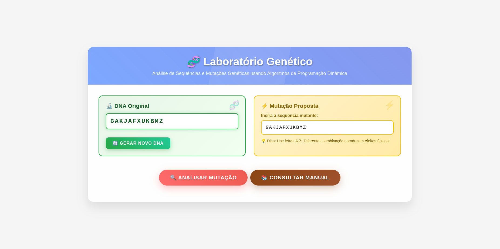
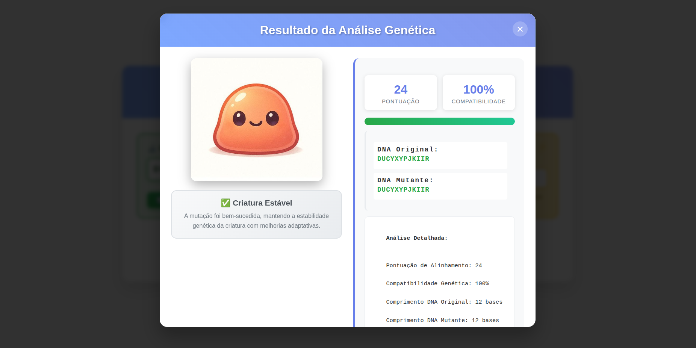
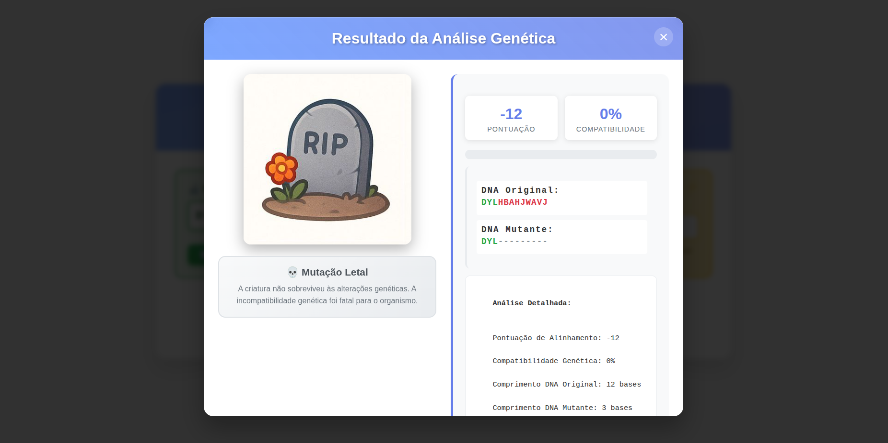
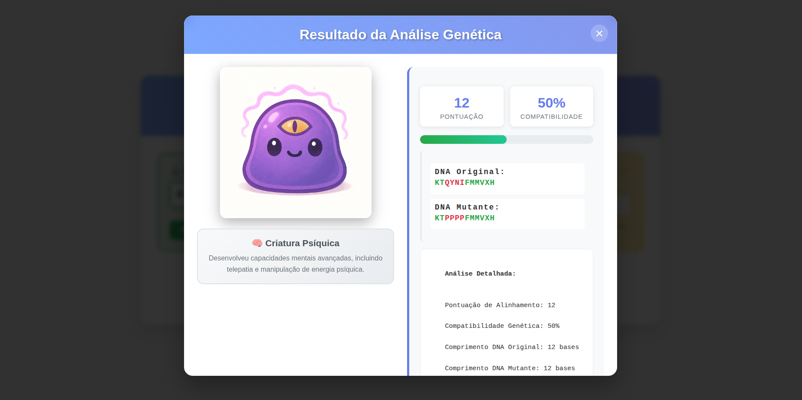
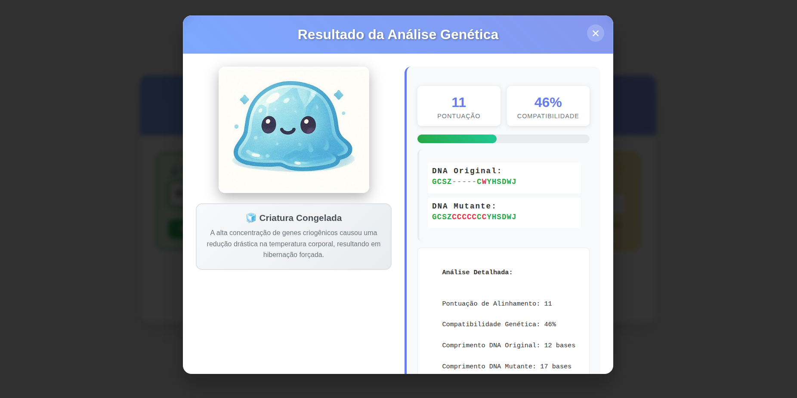
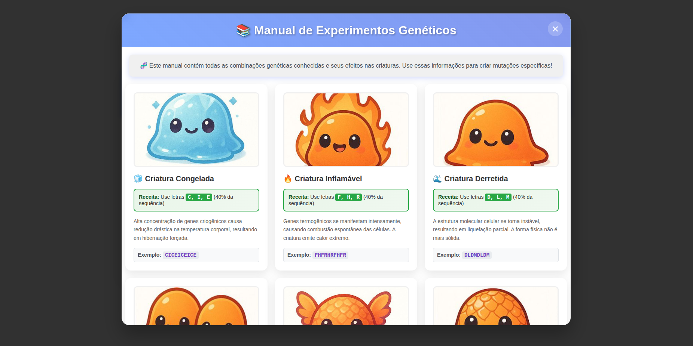

# PD_Laboratório-Genético

**Número da Lista**: 5<br>
**Conteúdo da Disciplina**: Programação dinâmica<br>

## Alunos
|Matrícula | Aluno |
| -- | -- |
| 22/021890  |  Manuella Magalhães Valadares |
| 22/021906  |  Marcos Vieira Marinho |

## Sobre 
O **Laboratório Genético** é uma aplicação web interativa que simula análises genéticas usando algoritmos de alinhamento de sequências baseados em programação dinâmica. O projeto implementa o algoritmo de Needleman-Wunsch para realizar alinhamento global entre uma sequência de DNA original (gerada aleatoriamente) e uma mutação proposta pelo usuário.

O sistema analisa a compatibilidade genética entre as sequências e determina o estado resultante da criatura, que pode variar desde estados normais até mutações extremas como congelamento, combustão, duplicação, desenvolvimento de asas, tentáculos, entre outros. Cada resultado é acompanhado de visualizações dinâmicas e relatórios detalhados da análise.

**Características principais:**
- Algoritmo de alinhamento de sequências Needleman-Wunsch
- Sistema de pontuação configurável (match: +2, mismatch: -1, gap: -2)
- Análise de padrões genéticos para determinação de estados
- Geração dinâmica de imagens representando diferentes estados da criatura

## Vídeo de Apresentação

[Link da Apresentação](https://projeto-de-algoritmos-2025.github.io/PD_lab/)

## Acesso ao deploy da aplicação

[Link da Aplicação](https://projeto-de-algoritmos-2025.github.io/PD_lab/)

## Screenshots
### Tela Principal

### Alguns resultados




### Manual de experimentos genéticos



## Instalação 
**Linguagem**: HTML5, CSS3 e JavaScript (ES6+)<br>
**Framework**: Vanilla JavaScript (sem frameworks externos)<br>

### Pré-requisitos:
- Navegador web moderno (Chrome, Firefox, Safari, Edge)

### Comandos para execução:

**Opção 1 - Servidor HTTP simples (Python):**
```bash
# Navegue até o diretório do projeto
cd PD_lab

# Python 3
python -m http.server 8000

# Acesse: http://localhost:8000
```

**Opção 2 - Acesso direto:**
```bash
# Abra o arquivo index.html diretamente no navegador
# Algumas funcionalidades podem ser limitadas sem servidor
```

## Uso 
1. **Geração de DNA**: Ao carregar a página, uma sequência de DNA de 10-12 caracteres é gerada automaticamente
2. **Nova Sequência**: Use o botão "🔄 Gerar Novo DNA" para criar uma nova sequência base
3. **Inserir Mutação**: Digite uma sequência de letras (A-Z) no campo "Mutação Proposta" (máximo 20 caracteres)
4. **Analisar**: Clique em "🔍 Analisar Mutação" para processar o alinhamento
5. **Visualizar Resultados**: O modal exibirá:
   - Imagem da criatura resultante
   - Pontuação de alinhamento
   - Percentual de compatibilidade
   - Sequências alinhadas coloridas
   - Descrição detalhada do estado da criatura

### Dicas para Diferentes Resultados:
- **Normal**: Sequências com boa compatibilidade
- **Congelado**: Use letras C, F, I (ex: "CCFIFICI")
- **Fogo**: Use letras F, H, R (ex: "FFHRHHRR")
- **Duplicado**: Use padrões repetidos (ex: "ABCABC", "XYYX")
- **Asas**: Use letras A, W, Y (ex: "AWWYAYWA")
- **Tentáculos**: Use letras T, U, V (ex: "TUVTUV")
- **Cristalino**: Use letras Q, X, Z (ex: "QXZQXZ")

## Outros 
### Algoritmo de Programação Dinâmica
O projeto implementa o algoritmo Needleman-Wunsch, um método clássico de programação dinâmica para alinhamento global de sequências. A complexidade é O(n×m) onde n e m são os comprimentos das sequências.

### Estrutura do Projeto
```
PD_lab/
├── index.html          # Página principal
├── style.css           # Estilos e animações
├── script.js           # Lógica do algoritmo e interações
├── assets/             # Imagens das criaturas
│   ├── normal.jpeg
│   ├── congelado.jpeg
│   ├── fogo.jpeg
│   └── ...
└── README.md           # Documentação
```

### Licença
Este projeto foi desenvolvido para fins acadêmicos como parte da disciplina de Projeto de Algoritmos.